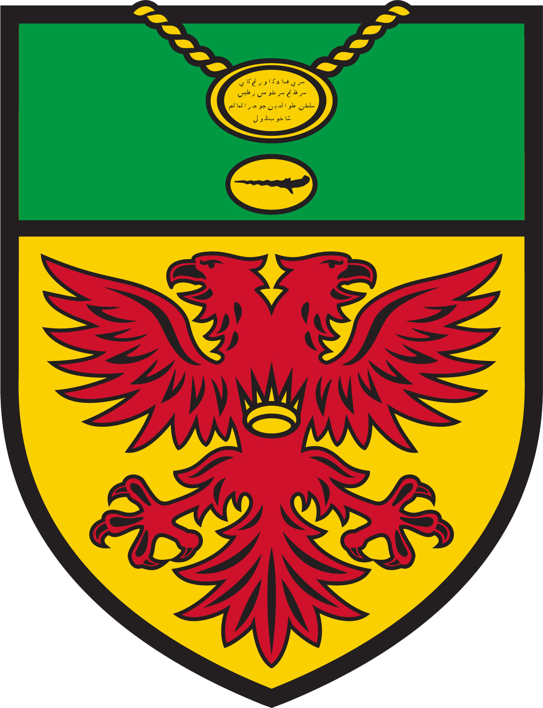

# ORA Hockey Team App

A mobile-first app for managing the ORA Hockey club (MHL1 league).

It gives the club one place to run both teams instead of juggling group chats and spreadsheets:

- Coaches and managers can manage the team roster, schedule games and training sessions, record player stats, and run polls for team decisions.
- Players can check the schedule, mark their attendance for games and training, view stats, and vote in polls.

Everyone signs in with their own account, and what they see depends on whether they're a coach/manager or a player.

---

## Roles & access

| | Player | Admin (coach / manager) |
|---|---|---|
| View schedule, squad, polls | Yes | Yes |
| Mark own attendance | Yes | Yes (admins are players too) |
| Vote in polls | Yes | Yes |
| Add / edit / delete events & players | - | Yes |
| Create / close / delete polls | - | Yes |

Admins also get a **Profile** tab and a **Dashboard** tab. Players see **Home**, **Squad**, **Schedule**, and **Polls** at the bottom of the screen.

> Tip for admins: double-tap the **ADMIN** badge in the top bar to flip into a player's view (handy for checking what the squad sees), and to set a preview date for the season.

---

## Getting into the app

- **New players** don't sign up themselves. A coach/manager sends you a **private setup link** (usually by WhatsApp). Open it, choose your own password, and you're in — the app matches you to your roster spot automatically. The link is single-use and expires after 24 hours; if it stops working, just ask for a new one.
- **Forgot your password?** Ask a coach/manager — they can send you a reset link the same way (that one expires after 1 hour).

---

## How to use - Players

### Home
Your landing screen. Shows the season record (W - D - L), your own stats tiles (Goals, Assists, Attendance %), the next scheduled game or training, the last result, and a prompt if there are active polls awaiting your vote.

### Squad
The full roster with season stats shown inline on each player's card (goals, assists, attendance, POTM points). Use the **season selector** at the top to switch between seasons. The two cards at the top show the live **POTS race** (player of the season points) and **top scorers**.

### Schedule
A list of games and training sessions, split into **Upcoming** and **Past**.

- Use the **All / Games / Trainings** filter chips to narrow the list.
- For any upcoming event, tap **I'm in / Maybe / Out** right on the card to set your attendance.
- **Tap any event** to open its detail view. There you can:
  - see the full details (opponent, date/time, venue, home/away, type, result and score for played games),
  - set or change your attendance,
  - see the **attendance breakdown** - Attending, Maybe, Not attending, Hasn't responded, in that order,
  - read the **Additional Information** note (added by coaches).

### Polls
Open polls show voting options - pick one and tap **Vote**. Once you've voted (or for closed polls) you'll see the live results with your choice marked "your vote". Closed polls are kept below for reference.

---

## How to use - Admins

### Dashboard
The club overview: this week's schedule at a glance, the season record, and quick counts (active players, admins, open polls).

### Squad
Manage the roster.

- **+** (top right) adds a player - full name, preferred name, email, jersey number, position(s) (FWD / MID / DEF / GK), and role (player or admin).
- Tap a player to **edit** their details.
- Toggle a player **active / inactive**; use "show inactive" to see everyone.
- Season stats, the POTS race, and top scorers are shown here just like the player view, driven by the selected season.

**Inviting players (accounts):** each Squad card shows a small dot - green = account active, amber = invited but not set up yet, grey = no account. Tap a player and scroll to the **Account** panel:

- **Invite link** creates their account and gives you a private one-time setup link - copy it or share straight to WhatsApp. The player opens it and picks their own password. Links expire after 24 hours; generating a new one is always one tap.
- **Password reset link** does the same for players who already have an account and got locked out (expires after 1 hour).
- Generate links as you send them (don't stockpile them the night before).

**Removing a player:** toggle them **inactive** - they keep their stats and history but drop out of the default roster. Deleting a player outright also deletes their stats, attendance, and votes, so inactive is almost always what you want.

### Schedule
- **+ Game** / **+ Training** adds an event (opponent, date/time, venue, home/away, type, score, notes). Leave the score blank until the game is played - the W/L/D result is worked out from the score automatically.
- **Tap any event** to open the detail view. As an admin you get an **Edit** button that turns the fields into editable inputs; **Save** writes the change and **Discard changes** cancels. You can also **delete** the event (this also removes its attendance and stats).

### Polls
- **+ New Poll** creates a poll: a question, 2-6 options, and an optional close date.
- Open polls can be **Closed** (or reopened), and any poll can be **Deleted** (votes included).
- Admins vote in polls just like players do.

### Profile
Your identity card - name, email, role, jersey number, and positions - plus a **Sign out** button.

---

## Notes for contributors

See `AGENTS.md` for the stack, database schema, and development setup. The app is a Next.js (App Router) + Supabase project; Vercel auto-deploys on push to `main`.
